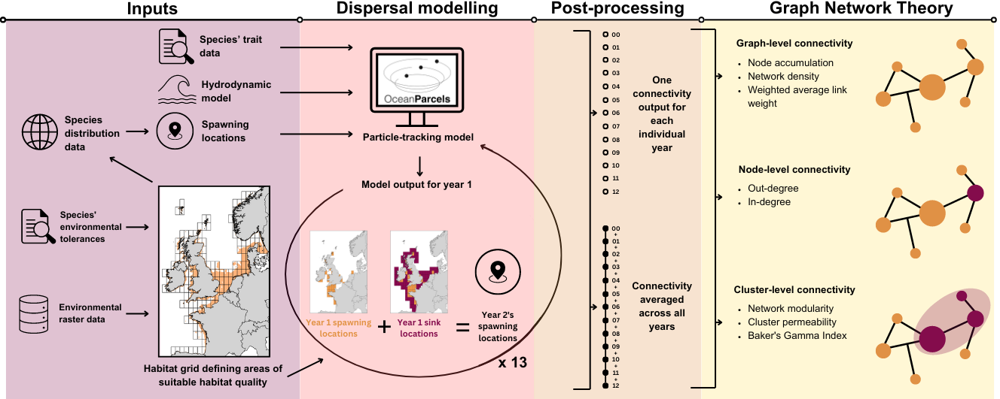

# Multi-generational-dispersal and dynamic patch occupancy reveals spatial and temporal stability of seascapes.

### Repository contains the code used to generate the figures and tables in the paper.

*Graphical abstract of the manuscript, detailing the methods used*
